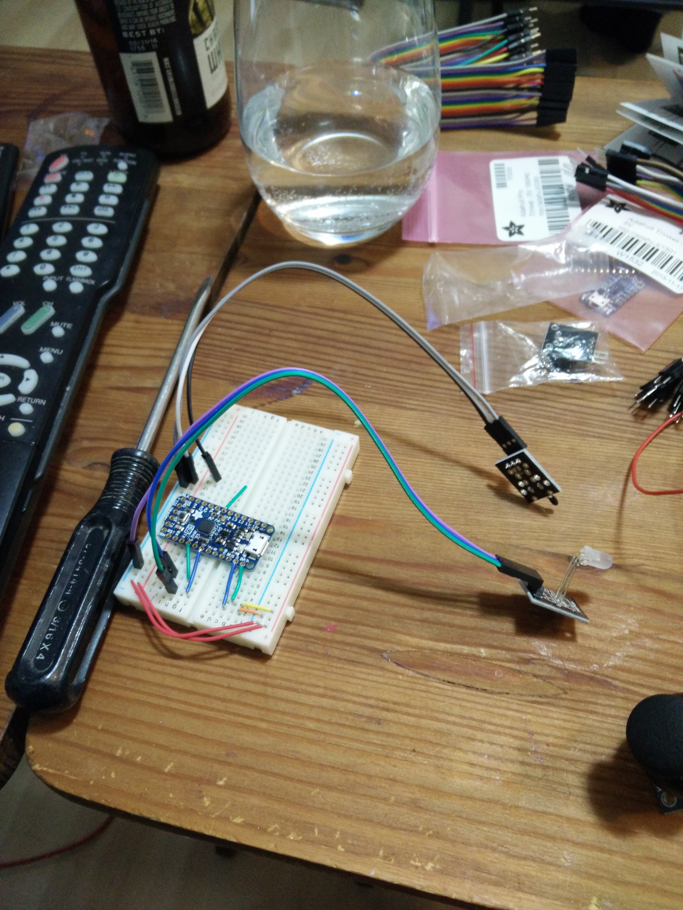
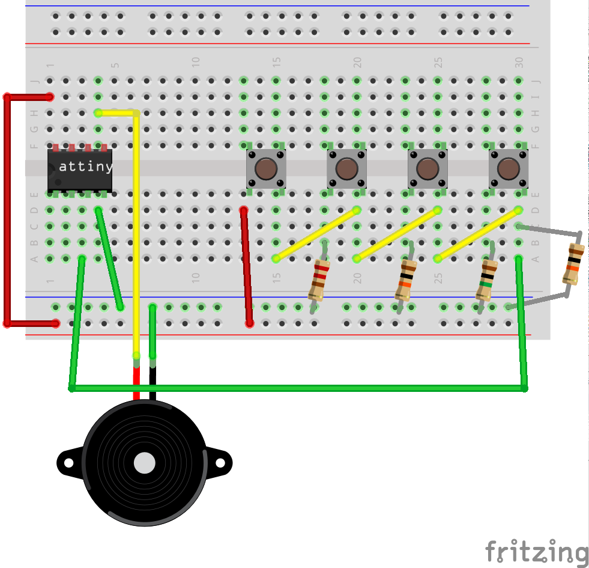
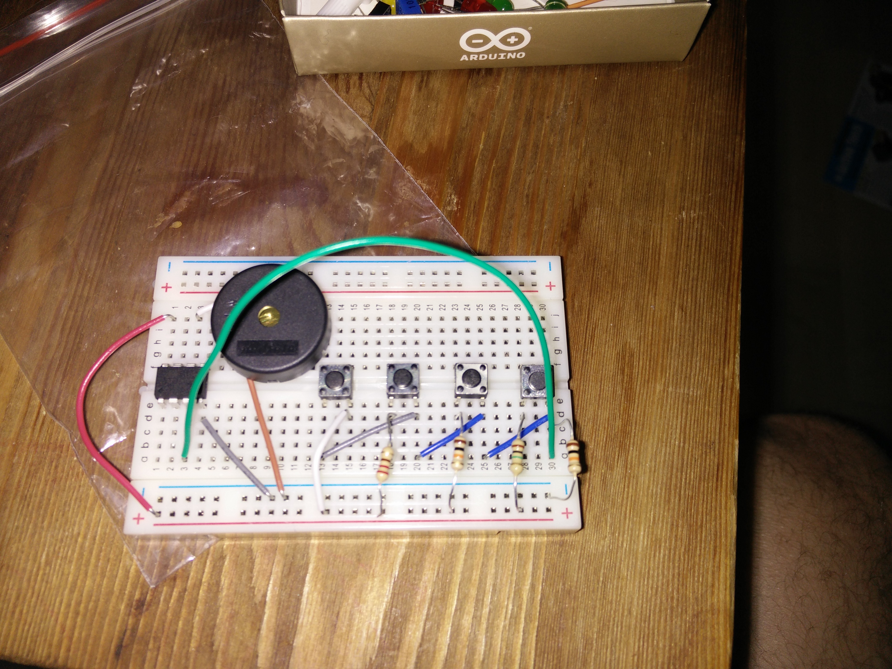
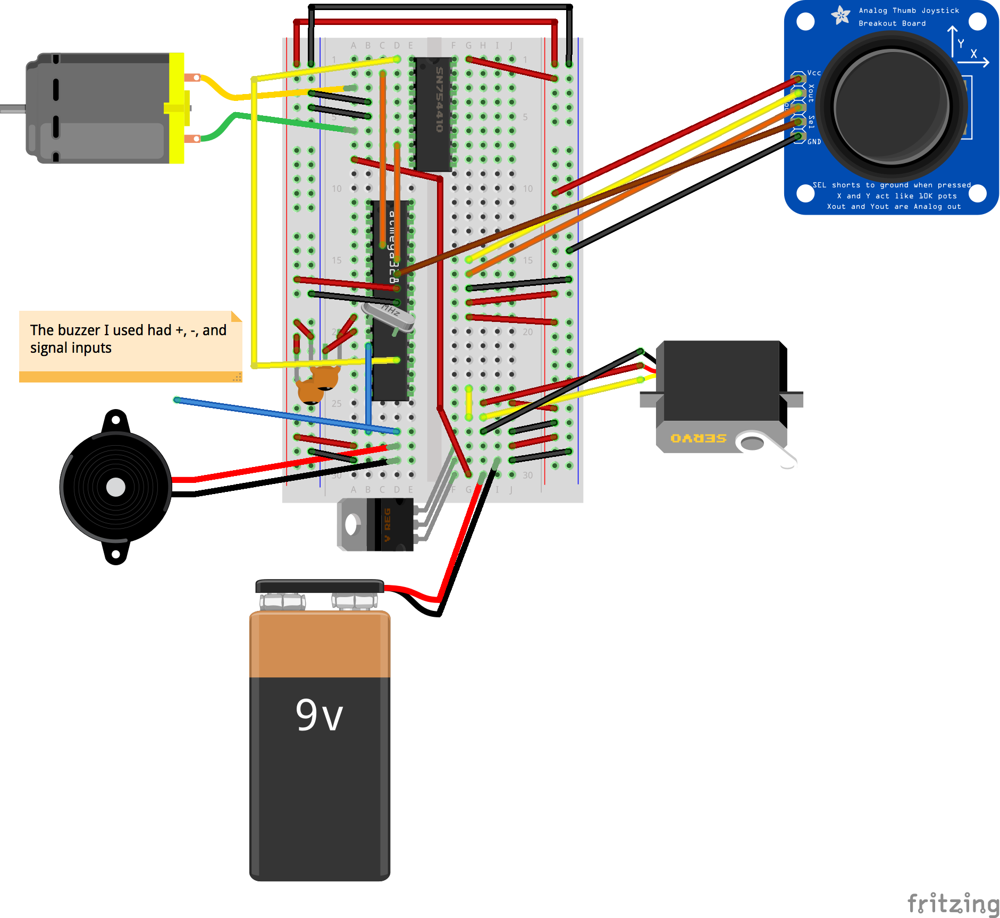
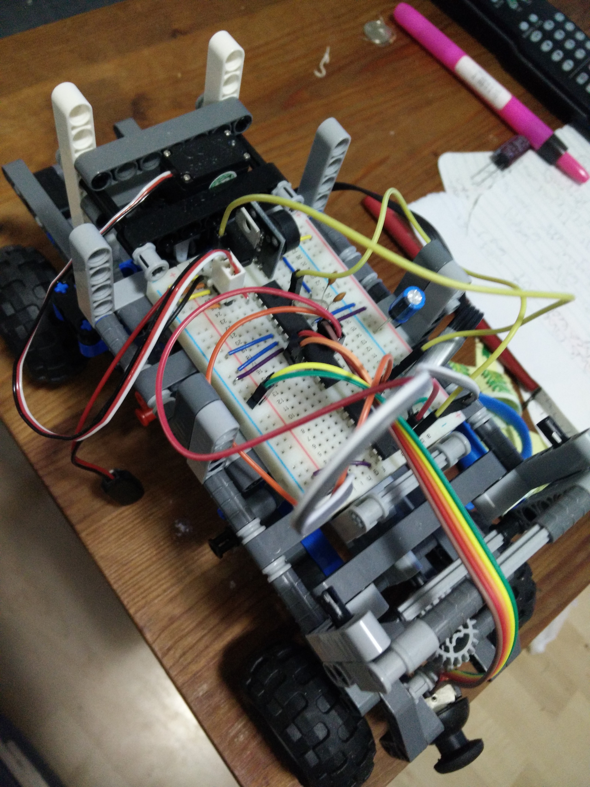
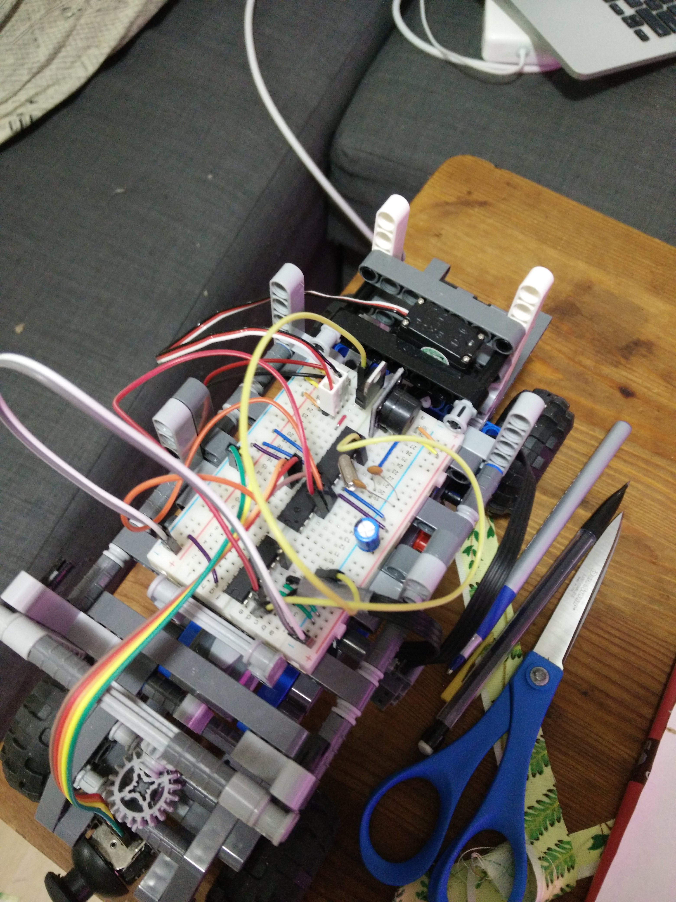
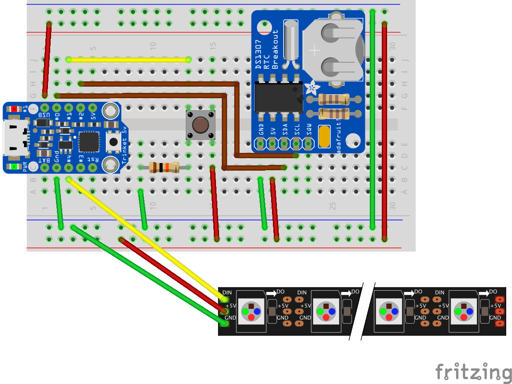

# Arduino Projects
A place to keep the code for my Arduino projects, in case of hardware failure

## Temperature Sensor
Uses the temperature sensor breakout to change the colour on the yellow/red LED breakout.

## Chase Lights
Six LEDs that light up in sequence. The direction and speed are determined by an analog resistor

## Keyboard Instrument
A 4 button keyboard that plays notes over a piezo. Uses the TinyTone library to work with the ATtiny85

(The video is using the Arduino Uno, but the concept is the same)
<iframe width="560" height="315" src="https://www.youtube.com/embed/9bY5rUgbe9g" frameborder="0" allowfullscreen></iframe>

## Lego Car
A car made out of lego. Uses a servo to control the front steering and a lego motor to power the rear wheels. Uses a PS controller for the controls. A push of the controller plays La Cucaracha.

For now the controller is hard wired, but eventually it will use RF to make a remote controller.

<iframe width="560" height="315" src="https://www.youtube.com/embed/o5PshL0zqwo" frameborder="0" allowfullscreen></iframe>

## LED Sunrise
Uses a 59 Neopixel LED strip from Adafruit. (Burned out the first LED) Cycles through the colours from Dark Blue to Red to Yellow to White.

(Uses the same schematic as the Drip Clock, without the button)

<iframe width="560" height="315" src="https://www.youtube.com/embed/AJnsbtaomg8" frameborder="0" allowfullscreen></iframe>

## LED Individual Sunrise
Like the regular Sunrise but an LED is selected at random and cycled towards the end colour. If the selected LED is at the last colour, a new LED is selected.

(Uses the same schematic as the Drip Clock, without the button)

<iframe width="560" height="315" src="https://www.youtube.com/embed/kyKph2ZRKNg" frameborder="0" allowfullscreen></iframe>

## LED Drip Clock
Uses a Neopixel strip vertically to display a clock where seconds, minutes, and hours drop down the strip. Each division of time is different colour of RGB and they add together if a LED has more than one division filled

<iframe width="560" height="315" src="https://www.youtube.com/embed/Jx6dTpjT0mM" frameborder="0" allowfullscreen></iframe>

## Remote control
I lost the code for these two videos, but the videos are pretty cool.
<iframe width="560" height="315" src="https://www.youtube.com/embed/lEl8lr9Ysio" frameborder="0" allowfullscreen></iframe>
<iframe width="560" height="315" src="https://www.youtube.com/embed/uCoWvACmjFk" frameborder="0" allowfullscreen></iframe>
