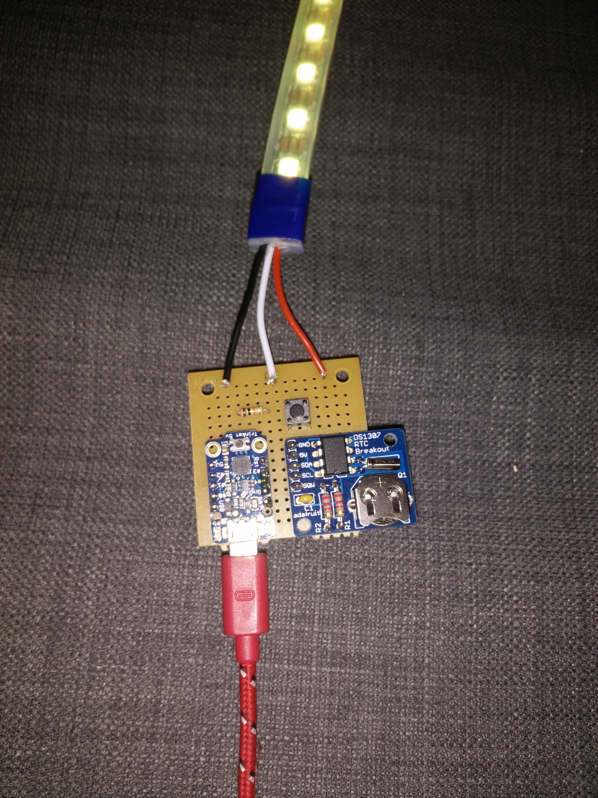
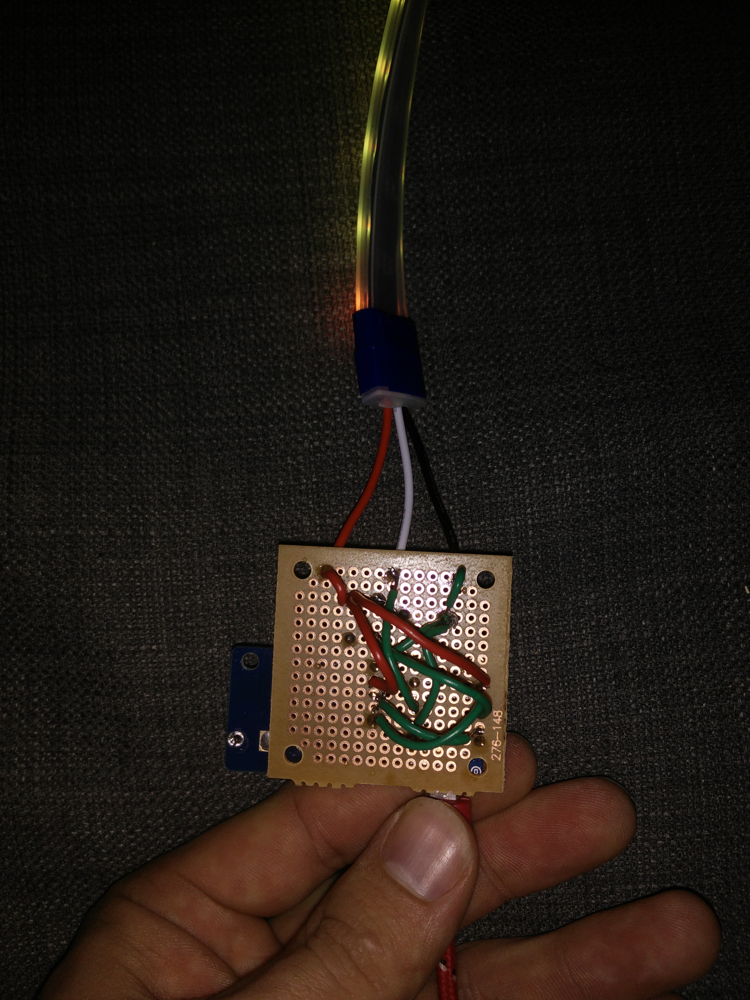
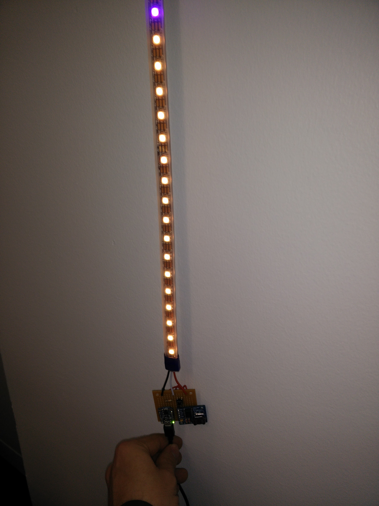

# LED Drip Clock
Uses a Neopixel strip vertically to display a clock where seconds, minutes, and hours drop down the strip. Each division of time is different colour of RGB and they add together if a LED has more than one division filled.

Technically, if an LED has hours, seconds, and minutes, it should be white, but that didn't look as good. I added some code to make it orange instead.

The button switches the direction in case it's being hung in a place where the power is coming from above and it would make more sense to have the guts at the top.

My first 'keeper' project. I soldered the items onto project board. I used a Trinket instead of just a ATtiny85 because it was easier to send power to it.

Click image for YouTube video

Click image for YouTube video

