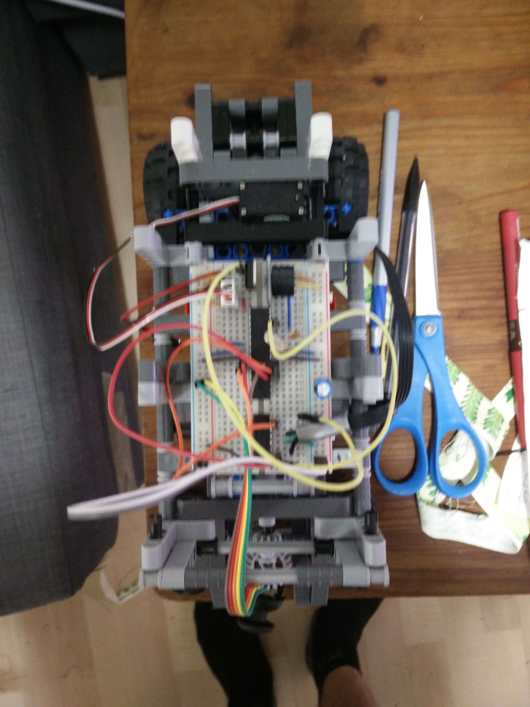

# Lego Car
A car made out of lego. Uses a servo to control the front steering and a lego motor to power the rear wheels. Uses a PS controller for the controls. A push of the controller plays La Cucaracha.

For now the controller is hard wired, but eventually it will use RF to make a remote controller.

